# Yorozuya - Arsitektur Codebase

## Overview

Yorozuya adalah **Shopee Seller Dashboard** yang dibangun dengan Next.js 14. Aplikasi ini membantu penjual Shopee untuk mengelola pesanan, booking, produk, chat, diskon, dan berbagai operasi toko lainnya dalam satu dashboard terpusat.

```mermaid
flowchart TB
    subgraph Frontend["🖥️ Frontend Layer"]
        Pages["Dashboard Pages<br/>(16 halaman)"]
        Hooks["Custom Hooks<br/>(16 hooks)"]
        Components["UI Components<br/>(45 komponen)"]
        Context["User Context"]
    end

    subgraph APILayer["🔌 API Layer"]
        Routes["API Routes<br/>(39 endpoints)"]
    end

    subgraph Services["⚙️ Services Layer"]
        ShopeeServices["Shopee Services<br/>(9 modul)"]
        BusinessServices["Business Services<br/>(booking, orders, etc)"]
        TokenManager["Token Manager"]
    end

    subgraph External["☁️ External"]
        ShopeeAPI["Shopee Partner API"]
        Supabase["Supabase DB"]
        Redis["Redis Cache"]
    end

    subgraph Core["🔧 Core Layer"]
        ShopeeClient["Shopee API Client<br/>(lib/shopee/)"]
    end

    Pages --> Hooks
    Hooks --> Routes
    Routes --> Services
    Services --> ShopeeClient
    Services --> TokenManager
    ShopeeClient --> ShopeeAPI
    TokenManager --> Redis
    TokenManager --> Supabase
    BusinessServices --> Supabase
```



---

## 📁 Struktur Direktori

```
yorozuya/
├── app/
│   ├── (auth)/              # Halaman autentikasi (login)
│   ├── (dashboard)/         # Halaman dashboard (16 halaman)
│   │   ├── dashboard/       # Dashboard utama
│   │   ├── orders/          # Manajemen pesanan
│   │   ├── booking/         # Manajemen booking
│   │   ├── produk/          # Manajemen produk
│   │   ├── discounts/       # Manajemen diskon
│   │   ├── flashsale/       # Flash sale
│   │   ├── webchat/         # Chat dengan pembeli
│   │   ├── pengaturan/      # Pengaturan
│   │   └── ...
│   ├── api/                 # API Routes (39 endpoints)
│   ├── hooks/               # Custom React hooks (16 hooks)
│   └── services/            # Business logic services
│       └── shopee/          # Shopee-specific services
├── lib/
│   └── shopee/              # Core Shopee API Client
│       ├── client.ts        # HTTP client dengan signature
│       ├── auth.ts          # Autentikasi
│       ├── orders.ts        # Pesanan
│       ├── bookings.ts      # Booking
│       ├── chat.ts          # Chat
│       ├── discounts.ts     # Diskon
│       ├── products.ts      # Produk
│       ├── logistics.ts     # Logistik
│       └── index.ts         # Re-export & ShopeeAPI class
├── components/              # Reusable UI components
├── contexts/                # React Context (UserDataContext)
├── types/                   # TypeScript type definitions
├── utils/                   # Utility functions
└── middleware.ts            # Session management
```

---

## 🏗️ Layer Architecture

### 1. Core Layer (`lib/shopee/`)

Layer paling dasar yang berkomunikasi langsung dengan Shopee Partner API.

| File | Fungsi |
|------|--------|
| [client.ts](file:///Users/yorozuya/Developer/next/yorozuya/lib/shopee/client.ts) | HTTP client dengan HMAC-SHA256 signature generation |
| [auth.ts](file:///Users/yorozuya/Developer/next/yorozuya/lib/shopee/auth.ts) | OAuth flow, token management |
| [orders.ts](file:///Users/yorozuya/Developer/next/yorozuya/lib/shopee/orders.ts) | Get order list, order details, ship order |
| [bookings.ts](file:///Users/yorozuya/Developer/next/yorozuya/lib/shopee/bookings.ts) | COD booking operations |
| [chat.ts](file:///Users/yorozuya/Developer/next/yorozuya/lib/shopee/chat.ts) | Shopee chat/messaging |
| [discounts.ts](file:///Users/yorozuya/Developer/next/yorozuya/lib/shopee/discounts.ts) | Discount & promo management |
| [products.ts](file:///Users/yorozuya/Developer/next/yorozuya/lib/shopee/products.ts) | Product CRUD operations |
| [logistics.ts](file:///Users/yorozuya/Developer/next/yorozuya/lib/shopee/logistics.ts) | Shipping & tracking |
| [index.ts](file:///Users/yorozuya/Developer/next/yorozuya/lib/shopee/index.ts) | Re-exports + backward-compatible `ShopeeAPI` class |

### 2. Services Layer (`app/services/`)

Business logic yang menggabungkan Shopee API calls dengan database operations.

| File | Fungsi |
|------|--------|
| [tokenManager.ts](file:///Users/yorozuya/Developer/next/yorozuya/app/services/tokenManager.ts) | Manajemen access token (refresh, cache di Redis) |
| [bookingService.ts](file:///Users/yorozuya/Developer/next/yorozuya/app/services/bookingService.ts) | CRUD booking orders ke Supabase |
| [databaseOperations.ts](file:///Users/yorozuya/Developer/next/yorozuya/app/services/databaseOperations.ts) | Upsert orders, items, logistics ke DB |
| [orderSyncs.ts](file:///Users/yorozuya/Developer/next/yorozuya/app/services/orderSyncs.ts) | Sinkronisasi order dari Shopee ke DB |
| [bookingSyncs.ts](file:///Users/yorozuya/Developer/next/yorozuya/app/services/bookingSyncs.ts) | Sinkronisasi booking dari Shopee ke DB |
| [redis.ts](file:///Users/yorozuya/Developer/next/yorozuya/app/services/redis.ts) | Redis client configuration |
| [SSEService.tsx](file:///Users/yorozuya/Developer/next/yorozuya/app/services/SSEService.tsx) | Server-Sent Events untuk real-time updates |

#### Shopee Services (`app/services/shopee/`)

| File | Fungsi |
|------|--------|
| [orders.ts](file:///Users/yorozuya/Developer/next/yorozuya/app/services/shopee/orders.ts) | High-level order operations |
| [bookings.ts](file:///Users/yorozuya/Developer/next/yorozuya/app/services/shopee/bookings.ts) | High-level booking operations |
| [products.ts](file:///Users/yorozuya/Developer/next/yorozuya/app/services/shopee/products.ts) | High-level product operations |
| [discounts.ts](file:///Users/yorozuya/Developer/next/yorozuya/app/services/shopee/discounts.ts) | High-level discount operations |
| [chat.ts](file:///Users/yorozuya/Developer/next/yorozuya/app/services/shopee/chat.ts) | High-level chat operations |
| [logistics.ts](file:///Users/yorozuya/Developer/next/yorozuya/app/services/shopee/logistics.ts) | High-level logistics operations |
| [shop.ts](file:///Users/yorozuya/Developer/next/yorozuya/app/services/shopee/shop.ts) | Shop info & settings |

### 3. API Layer (`app/api/`)

Next.js API routes yang menerima request dari frontend.

| Kategori | Endpoints |
|----------|-----------|
| **Auth** | `/api/auth/`, `/api/callback`, `/api/generate-auth-url` |
| **Orders** | `/api/orders`, `/api/order_details`, `/api/process-order`, `/api/cancel-order` |
| **Bookings** | `/api/bookings`, `/api/booking-orders` |
| **Shipping** | `/api/shipping-document`, `/api/tracking` |
| **Products** | `/api/produk`, `/api/get_sku` |
| **Discounts** | `/api/discount` |
| **Flash Sale** | `/api/flashsale` |
| **Chat** | `/api/msg` |
| **Shops** | `/api/shops`, `/api/profile` |
| **Sync** | `/api/sync`, `/api/auto-sync` |
| **Webhook** | `/api/webhook` |

### 4. Frontend Layer (`app/(dashboard)/`)

React components dengan custom hooks untuk state management.

| Hook | Fungsi |
|------|--------|
| [useOrders.ts](file:///Users/yorozuya/Developer/next/yorozuya/app/hooks/useOrders.ts) | Fetch & manage orders |
| [useBookings.ts](file:///Users/yorozuya/Developer/next/yorozuya/app/hooks/useBookings.ts) | Fetch & manage bookings |
| [useProducts.ts](file:///Users/yorozuya/Developer/next/yorozuya/app/hooks/useProducts.ts) | Fetch & manage products |
| [useDashboard.ts](file:///Users/yorozuya/Developer/next/yorozuya/app/hooks/useDashboard.ts) | Dashboard statistics |
| [useShops.ts](file:///Users/yorozuya/Developer/next/yorozuya/app/hooks/useShops.ts) | Shop management |
| [useDiscounts.ts](file:///Users/yorozuya/Developer/next/yorozuya/app/hooks/useDiscounts.ts) | Discount management |
| [useGetMessage.ts](file:///Users/yorozuya/Developer/next/yorozuya/app/hooks/useGetMessage.ts) | Chat messages |
| [useShippingDocument.ts](file:///Users/yorozuya/Developer/next/yorozuya/app/hooks/useShippingDocument.ts) | Shipping labels |

---

## 🔐 Authentication Flow


---

## 💾 Data Storage

### Supabase Tables (Primary)

| Table | Deskripsi |
|-------|-----------|
| `shopee_tokens` | Access & refresh tokens per shop |
| `orders` | Order data dari Shopee |
| `order_items` | Item dalam setiap order |
| `booking_orders` | COD booking data |
| `logistics` | Shipping & tracking info |
| `escrow_details` | Payment/escrow data |
| `user_settings` | Pengaturan per user |

### Redis (Cache)

| Key Pattern | Deskripsi |
|-------------|-----------|
| `shopee:token:{shopId}` | Cached access token (24h TTL) |
| `shopee:shop:{shopId}` | Shop info cache |

---

## 🔄 Key Business Flows

Lihat dokumentasi workflow terpisah di folder `/docs/workflows/`:

1. [Order Processing](file:///Users/yorozuya/Developer/next/yorozuya/docs/workflows/order-processing.md)
2. [Booking Management](file:///Users/yorozuya/Developer/next/yorozuya/docs/workflows/booking-management.md)
3. [Token Refresh](file:///Users/yorozuya/Developer/next/yorozuya/docs/workflows/token-refresh.md)
4. [Data Sync](file:///Users/yorozuya/Developer/next/yorozuya/docs/workflows/data-sync.md)
5. [Shipping Document](file:///Users/yorozuya/Developer/next/yorozuya/docs/workflows/shipping-document.md)

---

## 🛠️ Development

### Prerequisites
- Node.js 18+
- Supabase account
- Redis instance (Upstash/local)
- Shopee Partner account

### Environment Variables (.env.local)
```
NEXT_PUBLIC_SUPABASE_URL=
NEXT_PUBLIC_SUPABASE_ANON_KEY=
SUPABASE_SERVICE_ROLE_KEY=
SHOPEE_PARTNER_ID=
SHOPEE_PARTNER_KEY=
REDIS_URL=
```

### Running Locally
```bash
npm install
npm run dev
```
