# Chat & Messaging Workflow

Alur pengelolaan chat dengan pembeli Shopee.

## Diagram Alur

```mermaid
flowchart TB
    subgraph Fetch["1️⃣ Fetch Conversations"]
        A[getConversationList] --> B[List of conversations]
        B --> C[Display in sidebar]
    end

    subgraph Read["2️⃣ Read Messages"]
        C -->|User clicks| D[getMessages]
        D --> E[Display message thread]
    end

    subgraph Send["3️⃣ Send Message"]
        E --> F[User types message]
        F --> G[sendMessage API]
        G --> H[Shopee delivers]
        H --> I[Update conversation]
    end

    subgraph Notify["🔔 Real-time"]
        J[Webhook: NEW_MESSAGE] --> K[Update conversation list]
        K --> L[Show notification]
    end
```



---

## API Endpoints

| Endpoint | Method | Description |
|----------|--------|-------------|
| `/api/msg/conversations` | GET | List conversations |
| `/api/msg/messages` | GET | Get messages in conversation |
| `/api/msg/send` | POST | Send message |
| `/api/msg/read` | POST | Mark as read |

---

## Step-by-Step

### 1. List Conversations

**Hook:** [useGetMessage.ts](file:///Users/yorozuya/Developer/next/yorozuya/app/hooks/useGetMessage.ts)

```
GET /api/msg/conversations?shop_id={shopId}

Response:
{
  conversations: [
    {
      conversation_id: string,
      to_id: number (buyer user_id),
      to_name: string,
      to_avatar: string,
      latest_message_content: string,
      unread_count: number
    }
  ]
}
```

### 2. Get Messages

```
GET /api/msg/messages?shop_id={shopId}&conversation_id={conversationId}

Response:
{
  messages: [
    {
      message_id: string,
      message_type: "text" | "image" | "order" | ...,
      content: { text?: string, url?: string, ... },
      from_id: number,
      created_timestamp: number
    }
  ]
}
```

### 3. Send Message

**Hook:** [useSendMessage.ts](file:///Users/yorozuya/Developer/next/yorozuya/app/hooks/useSendMessage.ts)

```
POST /api/msg/send
{
  shop_id: number,
  to_id: number,
  message_type: "text" | "image",
  content: { text?: string }
}

Response:
{
  message_id: string,
  created_timestamp: number
}
```

---

## Message Types

| Type | Content Structure |
|------|-------------------|
| `text` | `{ text: string }` |
| `image` | `{ url: string }` |
| `order` | `{ order_sn: string }` |
| `product` | `{ item_id: number }` |
| `sticker` | `{ sticker_id: string }` |

---

## Components

**File:** [MiniChat.tsx](file:///Users/yorozuya/Developer/next/yorozuya/components/MiniChat.tsx)

```
- Floating chat widget
- Conversation list sidebar
- Message thread view
- Message input with send button
- Image upload support
- Unread badge
```

---

## Related Files

- [lib/shopee/chat.ts](file:///Users/yorozuya/Developer/next/yorozuya/lib/shopee/chat.ts) - Raw API calls
- [app/services/shopee/chat.ts](file:///Users/yorozuya/Developer/next/yorozuya/app/services/shopee/chat.ts) - High-level operations
- [app/hooks/useGetMessage.ts](file:///Users/yorozuya/Developer/next/yorozuya/app/hooks/useGetMessage.ts)
- [app/hooks/useSendMessage.ts](file:///Users/yorozuya/Developer/next/yorozuya/app/hooks/useSendMessage.ts)
- [app/hooks/useMarkAsRead.ts](file:///Users/yorozuya/Developer/next/yorozuya/app/hooks/useMarkAsRead.ts)
- [components/MiniChat.tsx](file:///Users/yorozuya/Developer/next/yorozuya/components/MiniChat.tsx)
- [app/(dashboard)/webchat/](file:///Users/yorozuya/Developer/next/yorozuya/app/(dashboard)/webchat)
