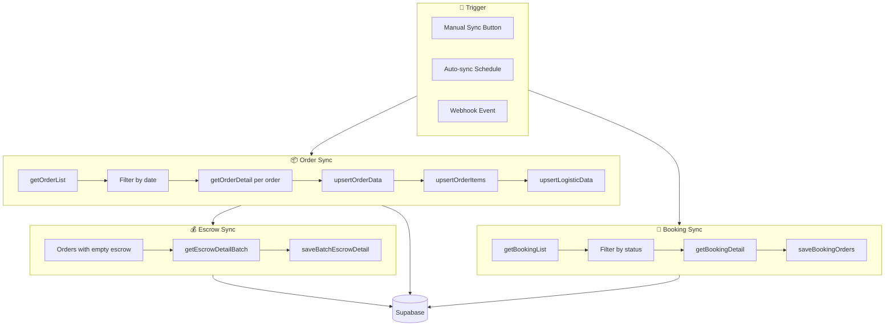

# Data Sync Workflow

Alur sinkronisasi data dari Shopee API ke local database.

## Diagram Alur



---

## Sync Types

| Type | Trigger | Scope | Frequency |
|------|---------|-------|-----------|
| Manual Sync | User clicks button | Selected shops, date range | On-demand |
| Auto Sync | Scheduled job | All active shops | Every 15 min |
| Webhook Sync | Shopee push | Single order/event | Real-time |

---

## Step-by-Step

### Order Sync

**File:** [orderSyncs.ts](file:///Users/yorozuya/Developer/next/yorozuya/app/services/orderSyncs.ts)

```
1. Untuk setiap shop:
   a. getValidAccessToken(shopId)
   b. getOrderList dengan filter:
      - time_range_field: "create_time"
      - time_from, time_to
      - order_status: ["READY_TO_SHIP", "PROCESSED", ...]
   c. Loop response.order_list:
      - getOrderDetail(shopId, orderSn, token)
      - upsertOrderData(orderData, shopId)
      - upsertOrderItems(orderData)
      - upsertLogisticData(orderData, shopId)
```

### Booking Sync

**File:** [bookingSyncs.ts](file:///Users/yorozuya/Developer/next/yorozuya/app/services/bookingSyncs.ts)

```
1. Untuk setiap shop:
   a. getValidAccessToken(shopId)
   b. getBookingList dengan filter:
      - booking_status: ["PENDING_PICKUP", "PROCESSING"]
   c. Batch booking_sn (max 50 per request)
   d. getBookingDetail(shopId, token, bookingSnList)
   e. saveBookingOrders(bookings, shopId)
```

### Escrow Sync

**File:** [useOrders.ts](file:///Users/yorozuya/Developer/next/yorozuya/app/hooks/useOrders.ts#L253-L355)

```
1. Query orders dengan escrow_amount = NULL
2. Batch order_sn (max 50 per request)
3. getEscrowDetailBatch(shopId, orderSnList, token)
4. saveBatchEscrowDetail(shopId, orderList)
```

---

## Database Operations

**File:** [databaseOperations.ts](file:///Users/yorozuya/Developer/next/yorozuya/app/services/databaseOperations.ts)

| Function | Table | Operation |
|----------|-------|-----------|
| `upsertOrderData` | orders | Upsert on order_sn |
| `upsertOrderItems` | order_items | Upsert on order_sn + item_id |
| `upsertLogisticData` | logistics | Upsert on order_sn |
| `saveEscrowDetail` | orders | Update escrow fields |
| `updateOrderStatusOnly` | orders | Quick status update |

---

## Error Handling & Retry

```typescript
async function withRetry<T>(
  operation: () => Promise<T>,
  maxRetries: number = 3,
  delayMs: number = 1000
): Promise<T> {
  for (let i = 0; i < maxRetries; i++) {
    try {
      return await operation();
    } catch (error) {
      if (i === maxRetries - 1) throw error;
      await sleep(delayMs * (i + 1)); // Exponential backoff
    }
  }
}
```

---

## Webhook Integration

**Endpoint:** `/api/webhook`

Shopee sends push notifications for:
- Order status change
- Tracking number update
- New message
- Return request

```
1. Receive webhook payload
2. Validate signature
3. Switch on push_type:
   - ORDER_STATUS_UPDATE → updateOrderStatusOnly
   - TRACKING_NO_UPDATE → trackingUpdate
   - BOOKING_STATUS_UPDATE → updateBookingOrder
4. Respond 200 OK
```

---

## Related Files

- [app/services/orderSyncs.ts](file:///Users/yorozuya/Developer/next/yorozuya/app/services/orderSyncs.ts)
- [app/services/bookingSyncs.ts](file:///Users/yorozuya/Developer/next/yorozuya/app/services/bookingSyncs.ts)
- [app/services/databaseOperations.ts](file:///Users/yorozuya/Developer/next/yorozuya/app/services/databaseOperations.ts)
- [app/api/webhook/route.ts](file:///Users/yorozuya/Developer/next/yorozuya/app/api/webhook)
- [app/api/sync/route.ts](file:///Users/yorozuya/Developer/next/yorozuya/app/api/sync)
