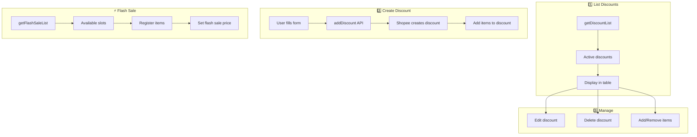

# Discounts & Promotions Workflow

Alur pengelolaan diskon dan promosi produk.

## Diagram Alur



---

## Discount Types

| Type | Description | API |
|------|-------------|-----|
| Regular Discount | Fixed/percentage off | `/api/discount` |
| Flash Sale | Time-limited sale | `/api/flashsale` |
| Bundle Deal | Buy more save more | `/api/discount/bundle` |
| Add-on Deal | Discounted add-ons | `/api/discount/addon` |

---

## Step-by-Step

### Create Discount

**File:** [discounts.ts](file:///Users/yorozuya/Developer/next/yorozuya/lib/shopee/discounts.ts)

```
1. POST /api/discount/create:
   {
     shop_id: number,
     discount_name: string,
     start_time: number (unix),
     end_time: number (unix)
   }

2. addDiscount API creates discount shell

3. POST /api/discount/add-item:
   {
     shop_id: number,
     discount_id: number,
     item_list: [
       {
         item_id: number,
         model_id: number,
         item_promotion_price: number
       }
     ]
   }
```

### Flash Sale Registration

**File:** [shopeeFlashSaleService.ts](file:///Users/yorozuya/Developer/next/yorozuya/app/services/shopeeFlashSaleService.ts)

```
1. GET /api/flashsale/timeslots
   - Get available flash sale time slots

2. POST /api/flashsale/register:
   {
     shop_id: number,
     timeslot_id: number,
     item_list: [
       {
         item_id: number,
         model_id: number,
         flash_sale_price: number,
         flash_sale_stock: number
       }
     ]
   }

3. Monitor registration status
```

---

## Related Files

- [lib/shopee/discounts.ts](file:///Users/yorozuya/Developer/next/yorozuya/lib/shopee/discounts.ts)
- [app/services/shopee/discounts.ts](file:///Users/yorozuya/Developer/next/yorozuya/app/services/shopee/discounts.ts)
- [app/services/shopeeFlashSaleService.ts](file:///Users/yorozuya/Developer/next/yorozuya/app/services/shopeeFlashSaleService.ts)
- [app/hooks/useDiscounts.ts](file:///Users/yorozuya/Developer/next/yorozuya/app/hooks/useDiscounts.ts)
- [app/(dashboard)/discounts/](file:///Users/yorozuya/Developer/next/yorozuya/app/(dashboard)/discounts)
- [app/(dashboard)/flashsale/](file:///Users/yorozuya/Developer/next/yorozuya/app/(dashboard)/flashsale)
