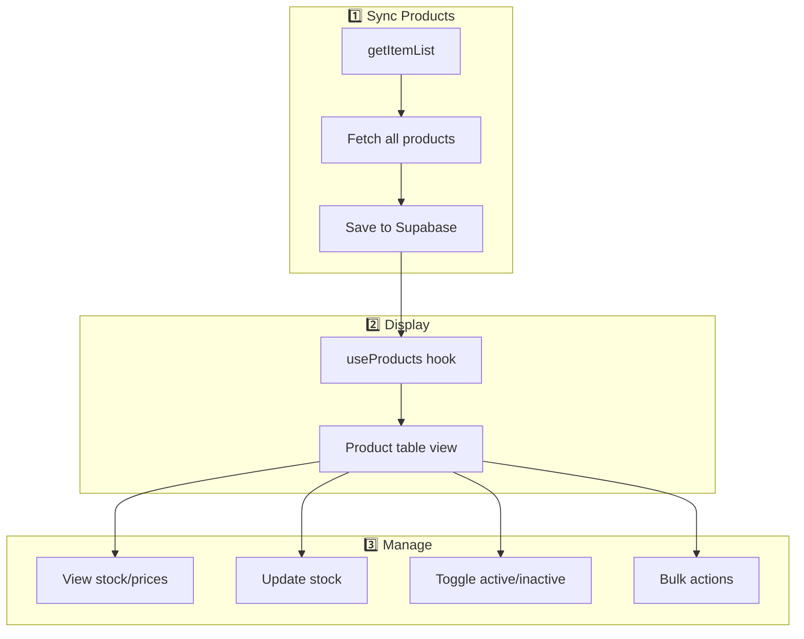

# Products Management Workflow

Alur pengelolaan produk: sync, view, update stok & harga.

## Diagram Alur



---

## Features

| Feature | Description |
|---------|-------------|
| Product List | View semua produk dari semua toko |
| Stock Management | Update stock per variant/model |
| Price Update | Update harga produk |
| Toggle Status | Aktif/nonaktifkan produk |
| Bulk Actions | Update multiple products sekaligus |

---

## Step-by-Step

### 1. Sync Products

**Hook:** [useProducts.ts](file:///Users/yorozuya/Developer/next/yorozuya/app/hooks/useProducts.ts#L250-L333)

```
1. User clicks "Sync Products"
2. syncProducts(shopIds, onProgress):
   a. POST /api/produk/sync dengan shop_id
   b. Shopee API: getItemList → get all item_ids
   c. Batch getItemBaseInfo untuk detail
   d. Save to Supabase (products table)
   e. Update progress callback
```

### 2. Get Stock & Prices

**Function:** [useProducts.getStockPrices](file:///Users/yorozuya/Developer/next/yorozuya/app/hooks/useProducts.ts#L335-L380)

```
1. User clicks on product
2. getStockPrices(itemId):
   a. GET /api/produk/models?item_id={itemId}
   b. Returns array of models dengan:
      - model_id, model_name
      - current_price, original_price
      - seller_stock, shopee_stock
      - total_available_stock
```

### 3. Update Stock

**Function:** [useProducts.updateStock](file:///Users/yorozuya/Developer/next/yorozuya/app/hooks/useProducts.ts#L382-L442)

```
1. User edits stock value
2. updateStock(shopId, itemId, modelUpdates):
   a. POST /api/produk/update-stock:
      {
        shop_id: number,
        item_id: number,
        stock_list: [
          { model_id: number, seller_stock: number }
        ]
      }
   b. Shopee API: updateStock
   c. Show success/error toast
```

### 4. Toggle Product Status

**Function:** [useProducts.toggleProductStatus](file:///Users/yorozuya/Developer/next/yorozuya/app/hooks/useProducts.ts#L444-L493)

```
1. User toggles active switch
2. toggleProductStatus(shopId, items):
   a. POST /api/produk/toggle:
      {
        shop_id: number,
        items: [{ item_id: number, unlist: boolean }]
      }
   b. Shopee API: unlistItem / setItemStatus
   c. Update local state
```

---

## API Endpoints

| Endpoint | Method | Description |
|----------|--------|-------------|
| `/api/produk` | GET | Get products from DB |
| `/api/produk/sync` | POST | Sync products from Shopee |
| `/api/produk/models` | GET | Get variants/models |
| `/api/produk/update-stock` | POST | Update stock |
| `/api/produk/update-price` | POST | Update price |
| `/api/produk/toggle` | POST | Toggle active status |

---

## Related Files

- [lib/shopee/products.ts](file:///Users/yorozuya/Developer/next/yorozuya/lib/shopee/products.ts) - Raw Shopee API calls
- [app/services/shopee/products.ts](file:///Users/yorozuya/Developer/next/yorozuya/app/services/shopee/products.ts) - High-level operations
- [app/hooks/useProducts.ts](file:///Users/yorozuya/Developer/next/yorozuya/app/hooks/useProducts.ts) - Frontend hook
- [app/(dashboard)/produk/](file:///Users/yorozuya/Developer/next/yorozuya/app/(dashboard)/produk) - Product pages
