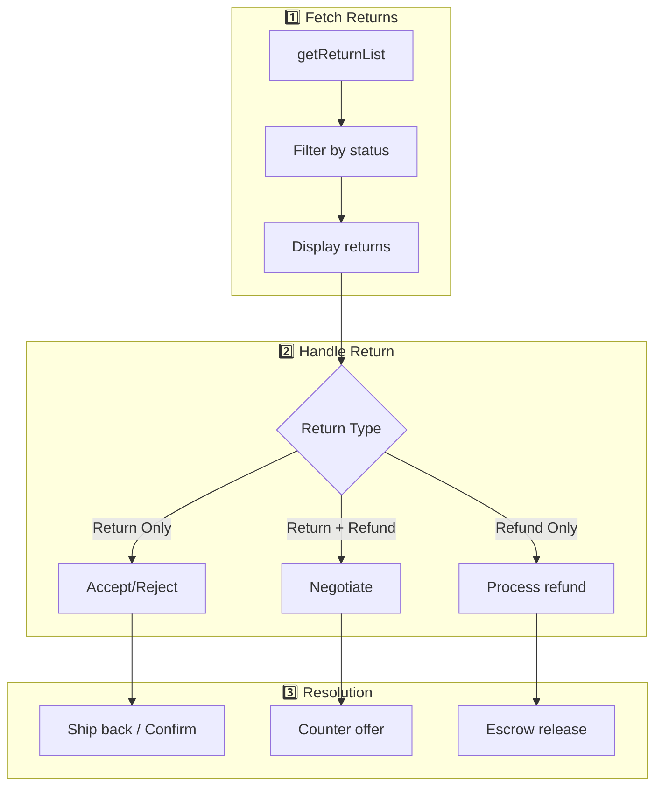

# Returns & Refunds Workflow

Alur penanganan return/retur dari pembeli.

## Diagram Alur



---

## Return Status Flow

```
REQUESTED → PROCESSING → ACCEPTED/REJECTED → COMPLETED/CANCELLED
```

| Status | Description |
|--------|-------------|
| `REQUESTED` | Buyer filed return request |
| `PROCESSING` | Under review/negotiation |
| `ACCEPTED` | Seller accepted return |
| `REJECTED` | Seller rejected return |
| `COMPLETED` | Return completed |
| `CANCELLED` | Return cancelled |

---

## Step-by-Step

### 1. Fetch Returns

**Hook:** [useReturns.ts](file:///Users/yorozuya/Developer/next/yorozuya/app/hooks/useReturns.ts)

```
1. GET /api/return?shop_id={shopId}&status={status}
2. Options:
   - status: PROCESSING (default), ALL, COMPLETED
   - page_no, page_size
   - create_time_from, create_time_to
3. Response: list of returns dengan detail
```

### 2. View Return Details

```
Each return contains:
- return_sn: Return number
- order_sn: Original order
- reason: Return reason from buyer
- status: Current status
- negotiation_status: NONE/PENDING/ACCEPTED/REJECTED
- seller_proof_status: Proof upload status
- item_list: Items being returned
- images: Proof images from buyer
```

### 3. Handle Return

**Endpoint:** `/api/return`

```
POST /api/return:
{
  action: "accept" | "reject" | "dispute",
  shop_id: number,
  return_sn: string,
  reason?: string  // for rejection
}
```

---

## Return Filters

| Filter | Values |
|--------|--------|
| `status` | PROCESSING, COMPLETED, ALL |
| `negotiation_status` | NONE, PENDING, ACCEPTED, REJECTED |
| `seller_proof_status` | NONE, PENDING, ACCEPTED, REJECTED |
| `seller_compensation_status` | NONE, PENDING, ACCEPTED |

---

## Related Files

- [lib/shopee/orders.ts](file:///Users/yorozuya/Developer/next/yorozuya/lib/shopee/orders.ts) - Return-related API calls
- [app/hooks/useReturns.ts](file:///Users/yorozuya/Developer/next/yorozuya/app/hooks/useReturns.ts) - Frontend hook
- [app/api/return/route.ts](file:///Users/yorozuya/Developer/next/yorozuya/app/api/return) - API endpoint
- [app/(dashboard)/return/](file:///Users/yorozuya/Developer/next/yorozuya/app/(dashboard)/return) - Return page
