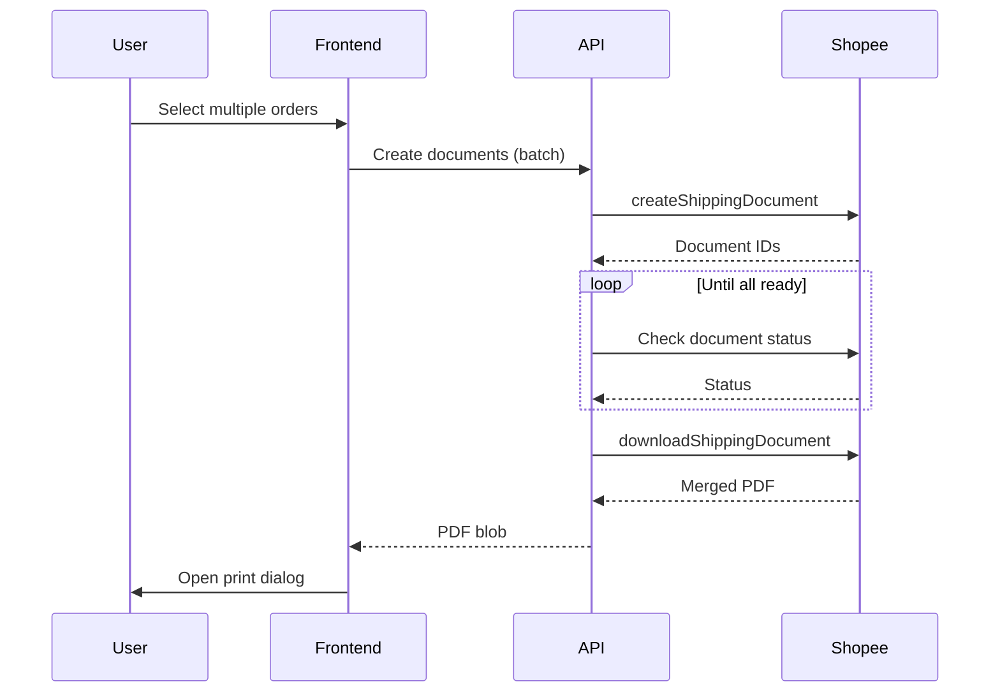

# Shipping Document Workflow

Alur pembuatan dan download dokumen pengiriman (resi/AWB).

## Diagram Alur

```mermaid
flowchart TB
    subgraph Select["1️⃣ Select Orders"]
        A[Orders with status SHIPPED]
        B[Bookings with tracking_number]
    end

    subgraph Create["2️⃣ Create Document"]
        C[/api/shipping-document/create]
        D[createShippingDocument API]
        E[Shopee generates document]
        F[Poll for ready status]
    end

    subgraph Download["3️⃣ Download"]
        G[downloadShippingDocument API]
        H[Receive PDF binary]
        I[Display/Print PDF]
    end

    subgraph Update["4️⃣ Update Status"]
        J[updateDocumentStatus]
        K[markDocumentsAsPrinted]
    end

    A --> C
    B --> C
    C --> D --> E --> F --> G --> H --> I
    I --> J
    I --> K
```

---

## Document Types

| Type | Description | Use Case |
|------|-------------|----------|
| `THERMAL_AIR_WAYBILL` | Thermal printer (10x15cm) | Default, most common |
| `NORMAL_AIR_WAYBILL` | A4/Letter size | Standard printer |
| `THERMAL_SLEEVE_AIR_WAYBILL` | With sleeve | Special packaging |

---

## Step-by-Step

### For Regular Orders

**Endpoint:** `/api/shipping-document`  
**File:** [logistics.ts](file:///Users/yorozuya/Developer/next/yorozuya/lib/shopee/logistics.ts)

```
1. POST /api/shipping-document/create:
   {
     shop_id: number,
     order_list: [{ order_sn: string }],
     document_type: "THERMAL_AIR_WAYBILL"
   }

2. API calls createShippingDocument:
   - POST /api/v2/logistics/create_shipping_document
   - Returns: { result_list: [{ order_sn, status }] }

3. POST /api/shipping-document/download:
   {
     shop_id: number,
     order_list: [{ order_sn: string }]
   }

4. API calls downloadShippingDocument:
   - POST /api/v2/logistics/download_shipping_document
   - Returns: PDF binary (application/pdf)

5. Frontend receives PDF:
   - Create blob URL
   - Open in new window for print
   - Or download directly
```

### For Bookings (COD)

**File:** [bookings.ts](file:///Users/yorozuya/Developer/next/yorozuya/lib/shopee/bookings.ts)

```
1. POST /api/shipping-document/booking/create:
   {
     shop_id: number,
     booking_list: [{ booking_sn: string, package_number?: string }]
   }

2. createBookingShippingDocument:
   - POST /api/v2/fulfillment/create_shipping_document

3. downloadBookingShippingDocument:
   - POST /api/v2/fulfillment/download_shipping_document
   - Returns: PDF binary

4. markDocumentsAsPrinted(shopId, bookingSnList):
   - Update is_printed = true in booking_orders table
```

---

## Frontend Integration

**Hook:** [useShippingDocument.ts](file:///Users/yorozuya/Developer/next/yorozuya/app/hooks/useShippingDocument.ts)

```typescript
const { downloadDocument, isLoading } = useShippingDocument();

// Usage
const handlePrint = async (orders: Order[]) => {
  const orderList = orders.map(o => ({ order_sn: o.order_sn }));
  const pdfBlob = await downloadDocument(shopId, orderList);
  
  // Open in new tab for printing
  const url = URL.createObjectURL(pdfBlob);
  window.open(url, '_blank');
};
```

---

## Batch Printing



---

## Error Handling

| Error | Cause | Solution |
|-------|-------|----------|
| `document_not_ready` | Document still generating | Retry after 2-3 seconds |
| `invalid_order_status` | Order not shipped yet | Ship order first |
| `tracking_number_missing` | No tracking yet | Wait for logistics update |
| `quota_exceeded` | Too many requests | Rate limit, use batch |

---

## Related Files

- [lib/shopee/logistics.ts](file:///Users/yorozuya/Developer/next/yorozuya/lib/shopee/logistics.ts) - Raw API calls
- [lib/shopee/bookings.ts](file:///Users/yorozuya/Developer/next/yorozuya/lib/shopee/bookings.ts) - Booking document APIs
- [app/hooks/useShippingDocument.ts](file:///Users/yorozuya/Developer/next/yorozuya/app/hooks/useShippingDocument.ts) - Frontend hook
- [utils/pdfUtils.ts](file:///Users/yorozuya/Developer/next/yorozuya/utils/pdfUtils.ts) - PDF handling utilities
- [app/api/shipping-document/](file:///Users/yorozuya/Developer/next/yorozuya/app/api/shipping-document) - API routes
