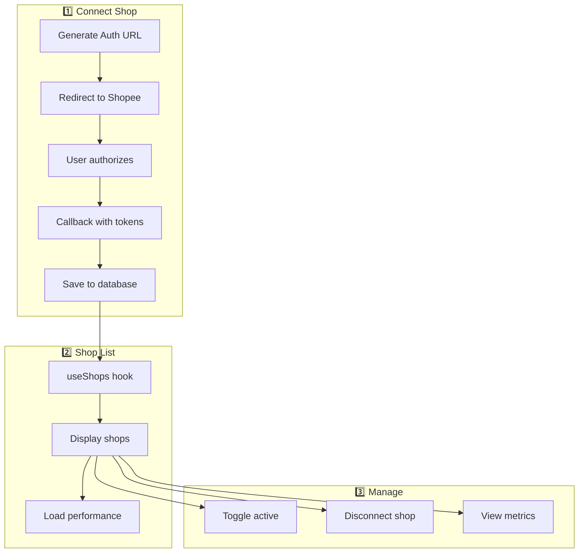

# Shop Management Workflow

Alur pengelolaan toko: koneksi, performance, pengaturan.

## Diagram Alur



---

## Features

| Feature | Description |
|---------|-------------|
| Connect Shop | OAuth untuk koneksi toko baru |
| Shop List | View semua toko yang terkoneksi |
| Performance | View metrics & penalty points |
| Toggle Active | Aktif/nonaktifkan toko |
| Disconnect | Hapus koneksi toko |

---

## Step-by-Step

### 1. Connect New Shop

**Endpoint:** `/api/generate-auth-url`

```
1. POST /api/generate-auth-url
2. Response: { auth_url: string }
3. Redirect user to Shopee OAuth
4. User login & authorize
5. Shopee redirects to /api/callback
6. Exchange code for tokens
7. Save tokens to Supabase
8. Redirect to shops page
```

### 2. List Shops

**Hook:** [useShops.ts](file:///Users/yorozuya/Developer/next/yorozuya/app/hooks/useShops.ts)

```
1. GET /api/shops
2. Returns array of shops:
   {
     shop_id: number,
     shop_name: string,
     is_active: boolean
   }
3. Display in table/cards
```

### 3. Load Performance Metrics

```
1. For each shop, fetch performance:
   GET /api/performance?shop_id={shopId}

2. Response contains:
   - overall_performance.rating: 1-4 (Buruk → Sangat Baik)
   - metric_list: Array of performance metrics
   - penalty.penalty_points: Penalty breakdown
   - penalty.ongoing_punishment: Active punishments
```

### 4. Toggle Shop Active Status

```
1. User clicks toggle
2. PUT /api/shops/{shopId}:
   { is_active: boolean }
3. Update shopee_tokens.is_active
4. Inactive shops excluded from syncs
```

### 5. Disconnect Shop

```
1. User clicks disconnect
2. POST /api/generate-deauth-url
3. Redirect to Shopee deauth
4. DELETE from shopee_tokens
5. Clear Redis cache
```

---

## Performance Metrics

| Metric Type | Description |
|-------------|-------------|
| Type 1 | Performa Pengiriman |
| Type 2 | Performa Listing |
| Type 3 | Performa Layanan Pelanggan |

| Rating | Text |
|--------|------|
| 1 | Buruk |
| 2 | Perlu Perbaikan |
| 3 | Baik |
| 4 | Sangat Baik |

---

## Database: shopee_tokens

| Column | Description |
|--------|-------------|
| shop_id | Primary key |
| shop_name | Shop name |
| is_active | Active status |
| access_token | Current token |
| refresh_token | Refresh token |
| user_id | Owner user |

---

## Related Files

- [app/hooks/useShops.ts](file:///Users/yorozuya/Developer/next/yorozuya/app/hooks/useShops.ts) - Frontend hook
- [app/api/shops/route.ts](file:///Users/yorozuya/Developer/next/yorozuya/app/api/shops) - Shop API
- [app/api/performance/route.ts](file:///Users/yorozuya/Developer/next/yorozuya/app/api/performance) - Performance API
- [app/(dashboard)/shops/](file:///Users/yorozuya/Developer/next/yorozuya/app/(dashboard)/shops) - Shop pages
