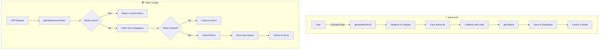

# Token Refresh Workflow

Alur manajemen dan refresh token Shopee OAuth.

## Diagram Alur



---

## Token Lifecycle

| Token Type | Expiry | Refresh Method |
|------------|--------|----------------|
| Access Token | 4 hours | Use refresh_token |
| Refresh Token | 30 days | User must re-authorize |
| Authorization | 1 year | User must re-authorize |

---

## Step-by-Step

### 1. Initial Authorization

**Endpoint:** `/api/generate-auth-url`  
**File:** [auth.ts](file:///Users/yorozuya/Developer/next/yorozuya/lib/shopee/auth.ts)

```
1. User click "Connect Shop"
2. generateAuthUrl(redirectUrl) → create signed URL
3. Redirect to Shopee OAuth page
4. User login & authorize
5. Shopee redirect to /api/callback
   - Query params: code, shop_id
```

### 2. Token Exchange

**Endpoint:** `/api/callback`  
**File:** [tokenManager.ts](file:///Users/yorozuya/Developer/next/yorozuya/app/services/tokenManager.ts)

```
1. Receive auth code + shop_id
2. getTokens(code, shopId, userId):
   a. shopeeApi.getTokens(code, shopId)
   b. getShopName(shopId, accessToken)
   c. saveTokens(shopId, tokens, shopName, userId)
      - Upsert to Supabase
      - Cache to Redis (24h TTL)
```

### 3. Get Valid Token

**File:** [tokenManager.ts](file:///Users/yorozuya/Developer/next/yorozuya/app/services/tokenManager.ts#L101-L130)

```typescript
getValidAccessToken(shopId):
  1. Check Redis cache: redis.hgetall(`shopee:token:${shopId}`)
  2. If found → return cached token
  3. If not → fetch from Supabase
  4. Return access_token
```

### 4. Token Refresh

**File:** [tokenManager.ts](file:///Users/yorozuya/Developer/next/yorozuya/app/services/tokenManager.ts#L85-L99)

```typescript
refreshToken(shopId, refreshToken, shopName, userId):
  for attempt in 1..3:
    try:
      1. shopeeApi.refreshAccessToken(refreshToken, shopId)
      2. saveTokens(shopId, newTokens, shopName, userId)
      3. Return new tokens
    catch:
      if attempt == 3: throw
      wait 2 seconds
```

---

## Storage Schema

### Supabase: `shopee_tokens`

| Column | Type | Description |
|--------|------|-------------|
| shop_id | int | Primary key |
| partner_id | int | Shopee partner ID |
| shop_name | string | Shop name |
| access_token | string | Current access token |
| refresh_token | string | Refresh token |
| access_token_expiry | timestamp | Access token expiry |
| refresh_token_expiry | timestamp | Refresh token expiry |
| is_active | boolean | Shop active status |
| user_id | uuid | Owner user ID |

### Redis: `shopee:token:{shopId}`

```
{
  "partner_id": "...",
  "shop_id": "...",
  "access_token": "...",
  "refresh_token": "...",
  "access_token_expiry": "...",
  "shop_name": "..."
}
TTL: 24 hours
```

---

## Error Scenarios

| Error | Cause | Solution |
|-------|-------|----------|
| `Token not found` | Shop not connected | Redirect to auth flow |
| `Refresh token expired` | 30+ days inactive | User re-authorize |
| `Invalid refresh token` | Token revoked | User re-authorize |
| `Authorization expired` | 1+ year inactive | User re-authorize |

---

## Related Files

- [lib/shopee/auth.ts](file:///Users/yorozuya/Developer/next/yorozuya/lib/shopee/auth.ts) - Auth URL generation, token exchange
- [app/services/tokenManager.ts](file:///Users/yorozuya/Developer/next/yorozuya/app/services/tokenManager.ts) - Token management
- [app/services/redis.ts](file:///Users/yorozuya/Developer/next/yorozuya/app/services/redis.ts) - Redis client
- [app/api/callback/route.ts](file:///Users/yorozuya/Developer/next/yorozuya/app/api/callback) - OAuth callback
