# User Settings & Automation Workflow

Alur pengaturan user: preferences, subscription, auto-ship.

## Diagram Alur

```mermaid
flowchart TB
    subgraph Settings["📝 User Settings"]
        A[UserSettingsService] --> B[Redis Cache]
        B --> C[Supabase DB]
    end

    subgraph Features["⚙️ Features"]
        D[OpenAI Config] --> E[AI Chat replies]
        F[Auto-Ship] --> G[Auto process orders]
        H[Cancel Message] --> I[Auto reply cancellation]
    end

    subgraph Subscription["💎 Subscription"]
        J[Free Plan] --> K[Basic features]
        L[Premium Plan] --> M[All features + limits]
    end
```



---

## Settings Structure

```typescript
interface UserSettings {
  // OpenAI Configuration
  openai_api?: string;
  openai_model?: string;
  openai_temperature?: number;
  openai_prompt?: string;

  // Auto-Ship
  auto_ship?: boolean;
  auto_ship_interval?: number;  // minutes

  // Auto-Reply
  in_cancel_msg?: string;       // Cancel message
  in_cancel_status?: boolean;
  in_return_msg?: string;       // Return message
  in_return_status?: boolean;

  // Subscription info
  subscription?: Subscription;

  // Shop list with settings
  shops: Shop[];
}

interface Shop {
  shop_id: number;
  shop_name: string;
  status_chat: boolean;   // Enable AI chat
  status_ship: boolean;   // Enable auto-ship
}
```

---

## Features

### 1. AI Chat Configuration

**File:** [userSettingsService.ts](file:///Users/yorozuya/Developer/next/yorozuya/app/services/userSettingsService.ts)

```
Configure OpenAI for auto-replies:
- openai_api: API key
- openai_model: gpt-3.5-turbo, gpt-4, etc.
- openai_temperature: 0.0 - 1.0
- openai_prompt: Custom system prompt
```

### 2. Auto-Ship

```
When enabled:
1. Scheduled job runs every {interval} minutes
2. For each shop with status_ship = true:
   a. Fetch READY_TO_SHIP orders
   b. Get shipping parameters
   c. Auto-ship with dropoff method
3. Send notification on completion
```

### 3. Auto-Reply for Cancellations/Returns

```
When in_cancel_status = true:
1. Webhook receives cancellation request
2. Send auto-reply: in_cancel_msg
3. Process cancellation (accept/reject based on settings)
```

---

## Storage

### Redis Keys

| Key Pattern | TTL | Data |
|-------------|-----|------|
| `user_settings:{userId}` | ∞ | Full settings JSON |
| `shop_to_user:{shopId}` | ∞ | userId string |
| `shopee:token:{shopId}` | 24h | Token data |

### Supabase Tables

| Table | Description |
|-------|-------------|
| `user_settings` | User preferences |
| `subscriptions` | Subscription status |
| `subscription_plans` | Available plans |

---

## Subscription Plans

| Plan | Features |
|------|----------|
| Free | Basic order management, 1 shop |
| Basic | + AI chat, 3 shops |
| Premium | + Flash sale, bulk actions, 10 shops |
| Admin | All features, unlimited shops |

---

## API Endpoints

| Endpoint | Method | Description |
|----------|--------|-------------|
| `/api/settings` | GET | Get user settings |
| `/api/settings` | PUT | Update settings |
| `/api/settings/shop` | PUT | Update shop settings |

---

## Related Files

- [app/services/userSettingsService.ts](file:///Users/yorozuya/Developer/next/yorozuya/app/services/userSettingsService.ts) - Settings service
- [app/services/premiumFeatureService.ts](file:///Users/yorozuya/Developer/next/yorozuya/app/services/premiumFeatureService.ts) - Premium features
- [app/api/settings/route.ts](file:///Users/yorozuya/Developer/next/yorozuya/app/api/settings) - Settings API
- [app/(dashboard)/pengaturan/](file:///Users/yorozuya/Developer/next/yorozuya/app/(dashboard)/pengaturan) - Settings pages
- [contexts/UserDataContext.tsx](file:///Users/yorozuya/Developer/next/yorozuya/contexts/UserDataContext.tsx) - User context
